<div align="center">


# ✨ iAgent: RUC Agent Family

<h3>Towards General, Scalable, Powerful, and Safe Intelligent Agents</h3>

[](https://github.com/RUC-NLPIR/AgentFamily)
[](LICENSE)
[]()
[]()

<p align="center">
  <a href="#-overview">Overview</a> •
  <a href="#-latest-news">News</a> •
  <a href="#-agent-family">Agent Family</a> •
  <a href="#-research-landscape">Research</a> •
  <a href="#-huggingface-models--datasets">Models & Datasets</a> •
  <a href="#-citation">Citation</a> •
  <a href="#-contact">Contact</a>
</p>

</div>

---

## 🎯 Overview

Welcome to the **RUC-NLPIR Agent Family**! Our mission is to develop general-purpose, scalable, powerful, and secure intelligent agents. This repository encompasses **12+ cutting-edge agent systems** across multiple research directions:

- 🤖 **Agentic Reinforcement Learning**: State-of-the-art RL algorithms for agent training (ARPO, AEPO)
- 🔍 **Deep Search & Research Agents**: Advanced information seeking, synthesis, and report generation
- 🛠️ **Multi-Tool Reasoning Agents**: Autonomous tool discovery, optimization, and execution
- 🎯 **Domain-Specific Agents**: Finance, video understanding, and multimodal applications
- 📊 **Comprehensive Benchmarks**: Evaluation datasets and standardized protocols

> [!TIP]
> ⭐ **Star us on GitHub** to stay updated with the latest releases and improvements!

---

## 📣 Latest News

- **[Oct 31, 2025]** 🔄 **HiRA Updated!** Hierarchical reasoning framework for decoupled planning and execution in deep search, latest revision available. [[Arxiv](https://arxiv.org/abs/2507.02652)] [[Code](https://github.com/RUC-NLPIR/HiRA)]

- **[Oct 24, 2025]**  **DeepAgent Released!** A general reasoning agent with scalable toolsets for autonomous thinking, tool discovery and action execution. [[Arxiv](https://arxiv.org/abs/2510.21618)] [[Code](https://github.com/RUC-NLPIR/DeepAgent)]

- **[Oct 21, 2025]** 🎥 **VideoExplorer Updated!** Think with videos for agentic long-video understanding, latest revision available. [[Arxiv](https://arxiv.org/abs/2506.10821)] [[Code](https://github.com/yhy-2000/VideoDeepResearch)]

- **[Oct 19, 2025]** 💰 **FinSight Released!** Multi-agent framework for real-world financial deep research and report generation. [[Arxiv](https://arxiv.org/abs/2510.16844)]

- **[Oct 16, 2025]** 🚀 **AEPO Released!** Entropy-balanced agentic RL algorithm with superior performance on GAIA, HLE, and AIME. [[Arxiv](https://arxiv.org/abs/2510.14545)] [[Code](https://github.com/RUC-NLPIR/ARPO)] [[🤗HuggingFace](https://huggingface.co/collections/dongguanting/aepo)] [[Blog](#)]

- **[Oct 13, 2025]** 🌐 **WebThinker Updated!** Deep research capability for LRMs with autonomous web search and report drafting, accepted by **NeurIPS 2025**. [[Arxiv](https://arxiv.org/abs/2504.21776)] [[Code](https://github.com/RUC-NLPIR/WebThinker)]

- **[Sep 30, 2025]** 💡 **Tool-Light Updated!** Self-evolved preference learning for effective tool-integrated reasoning, latest revision available. [[Arxiv](https://arxiv.org/abs/2509.23285)]

- **[Aug 11, 2025]** 🏢 **HierSearch Released!** Hierarchical enterprise deep search framework integrating local and web searches. [[Arxiv](https://arxiv.org/abs/2508.08088)] [[Code](https://github.com/plageon/HierSearch)]

- **[Jul 26, 2025]** 🎯 **ARPO Released!** Agentic reinforced policy optimization for multi-turn LLM-based agents with entropy-based adaptive rollout. [[Arxiv](https://arxiv.org/abs/2507.19849)] [[Code](https://github.com/RUC-NLPIR/ARPO)]

- **[May 22, 2025]** ⭐ **Tool-Star Released!** Empowering LLM-brained multi-tool reasoner via reinforcement learning with six types of tools. [[Arxiv](https://arxiv.org/abs/2505.16410)] [[Code](https://github.com/RUC-NLPIR/Tool-Star)]

- **[Jan 9, 2025]** 🔍 **Search-o1 Released!** Agentic search-enhanced large reasoning models with dynamic knowledge retrieval and document reasoning, accepted by **EMNLP 2025**. [[Arxiv](https://arxiv.org/abs/2501.05366)] [[Code](https://github.com/RUC-NLPIR/Search-o1)]

---

## 🔥 Agent Family

### 🤖 Agentic Reinforcement Learning

<table>
<tr>
<td width="50%">

**[AEPO: Agentic Entropy-Balanced Policy Optimization](https://arxiv.org/abs/2510.14545)**

🏆 *HuggingFace Daily Paper #2*

Advanced agentic RL algorithm balancing entropy in rollout and policy update phases for superior stability and performance.

**Key Features:**
- 🎯 Entropy-balanced optimization
- 📈 Superior stability on complex tasks
- 🏆 SOTA on GAIA, HLE, and AIME benchmarks

[](https://github.com/RUC-NLPIR/ARPO)
[](https://arxiv.org/abs/2510.14545)
[](https://github.com/RUC-NLPIR/ARPO)

</td>
<td width="50%">

**[ARPO: Agentic Reinforced Policy Optimization](https://arxiv.org/abs/2507.19849)**

🏆 *HuggingFace Weekly Paper #1*

Pioneering agentic RL with entropy-driven adaptive branching for enhanced exploration during tool calls.

**Key Features:**
- 🌳 Adaptive branching mechanism
- 🔍 Enhanced exploration strategy
- 🚀 Multi-turn agent optimization

[](https://github.com/RUC-NLPIR/ARPO)
[](https://arxiv.org/abs/2507.19849)
[](https://github.com/RUC-NLPIR/ARPO)

</td>
</tr>
</table>

---

### 🔍 Deep Research & Search Agents

<table>
<tr>
<td width="50%">

**[Search-o1: Agentic Search-Enhanced Large Reasoning Models](https://arxiv.org/abs/2501.05366)**

📜 ***EMNLP 2025 (Oral)***

Prompt-based reasoning with integrated autonomous knowledge retrieval through Agentic RAG.

**Key Features:**
- 🔍 Agentic RAG integration
- 🧠 Dynamic knowledge retrieval
- 📚 Document-level reasoning

[](https://github.com/RUC-NLPIR/Search-o1)
[](https://arxiv.org/abs/2501.05366)
[](https://github.com/RUC-NLPIR/Search-o1)

</td>
<td width="50%">

**[WebThinker: Empowering Large Reasoning Models with Deep Research](https://arxiv.org/abs/2504.21776)**

📜 ***NeurIPS 2025***

Deep research agent with simultaneous thinking, searching, and report writing capabilities.

**Key Features:**
- 💭 Concurrent thinking & searching
- ✍️ Automated report generation
- 🌐 Multi-source information synthesis

[](https://github.com/RUC-NLPIR/WebThinker)
[](https://arxiv.org/abs/2504.21776)
[](https://github.com/RUC-NLPIR/WebThinker)

</td>
</tr>
<tr>
<td width="50%">

**[HiRA: Hierarchical Reasoning for Deep Search](https://arxiv.org/abs/2507.02652)**

Decoupled planning and execution with strategic planning and domain-specific execution modules.

**Key Features:**
- 🎯 Decoupled planning & execution
- 🏗️ Hierarchical architecture
- 🔧 Domain-specific modules

[](https://github.com/RUC-NLPIR/HiRA)
[](https://arxiv.org/abs/2507.02652)
[](https://github.com/RUC-NLPIR/HiRA)

</td>
<td width="50%">

**[HierSearch: Hierarchical Enterprise Deep Search](https://arxiv.org/abs/2508.08088)**

Hierarchical search across local and online knowledge sources for comprehensive information retrieval.

**Key Features:**
- 🏢 Enterprise-grade search
- 🔄 Local & web integration
- 📊 Comprehensive retrieval

[](https://github.com/plageon/HierSearch)
[](https://arxiv.org/abs/2508.08088)
[](https://github.com/plageon/HierSearch)

</td>
</tr>
</table>

---

### 🛠️ Multi-Tool & Multimodal Reasoning

<table>
<tr>
<td width="50%">

**[DeepAgent: General Reasoning with Scalable Toolsets](https://arxiv.org/abs/2510.21618)**

🏆 *HuggingFace Daily Paper #1*

End-to-end reasoning agent with autonomous thinking, tool discovery, and brain-inspired memory folding.

**Key Features:**
- 🔍 Autonomous tool discovery
- 🧠 Brain-inspired memory architecture
- 🎯 End-to-end agentic reasoning

[](https://github.com/RUC-NLPIR/DeepAgent)
[](https://arxiv.org/abs/2510.21618)
[](https://github.com/RUC-NLPIR/DeepAgent)

</td>
<td width="50%">

**[Tool-Star: LLM-Brained Multi-Tool Reasoner](https://arxiv.org/abs/2505.16410)**

Multi-tool collaboration with Self-Critic RL for autonomous tool interaction and coordination.

**Key Features:**
- 🌟 Self-Critic RL training
- 🛠️ Six-type tool mastery
- 🤝 Multi-tool collaboration

[](https://github.com/RUC-NLPIR/Tool-Star)
[](https://arxiv.org/abs/2505.16410)
[](https://github.com/RUC-NLPIR/Tool-Star)

</td>
</tr>
<tr>
<td width="50%">

**[ToolScope: Agentic Search & Reasoning Framework](https://arxiv.org/abs/2510.27363)**

An Agentic Framework for Vision-Guided and Long-Horizon Tool Use.

**Key Features:**
- 🔄 Visual guided tools
- 🎯 Long-Horizon Tool Use
- 📈 Visual Agentic Reasoning

[]()
[](https://arxiv.org/abs/2510.27363)

</td>
<td width="50%">

**[Tool-Light: Self-Evolved Preference Learning](https://arxiv.org/abs/2509.23285)**

Lightweight optimization strategies encouraging efficient tool calling with minimal overhead.

**Key Features:**
- ⚡ Lightweight optimization
- 📚 Self-evolved learning
- 🎯 Efficient tool calling

[](https://github.com/RUC-NLPIR/Tool-Light)
[](https://arxiv.org/abs/2509.23285)

</td>
</tr>
</table>

---

### 🎯 Domain-Specific Agents

<table>
<tr>
<td width="50%">

**[FinSight: Real-World Financial Deep Research](https://arxiv.org/abs/2510.16844)**

Specialized agent for financial report generation, analysis, and investment research automation.

**Key Features:**
- 💼 Financial analysis automation
- 📊 Real-time market research
- 📈 Investment report generation

[](https://arxiv.org/abs/2510.16844)

</td>
<td width="50%">

**[VideoExplorer: Agentic Long-Video Understanding](https://arxiv.org/abs/2506.10821)**

Deep research methodology for comprehensive long-form video analysis and question answering.

**Key Features:**
- 🎥 Long-video understanding
- 🤔 Think-with-videos approach
- ❓ Complex video Q&A

[](https://github.com/yhy-2000/VideoDeepResearch)
[](https://arxiv.org/abs/2506.10821)
[](https://github.com/yhy-2000/VideoDeepResearch)

</td>
</tr>
</table>

---

## 📊 Research Landscape

```mermaid
graph TB
    A[🌟 RUC-NLPIR Agent Family] --> B[🤖 Agentic RL]
    A --> C[🔍 Deep Research]
    A --> D[🛠️ Multi-Tool]
    A --> E[🎯 Domain-Specific]
    
    B --> B1[ARPO<br/>Weekly #1]
    B --> B2[AEPO<br/>Daily #2]
    
    C --> C1[Search-o1<br/>EMNLP 2025]
    C --> C2[WebThinker<br/>NeurIPS 2025]
    C --> C3[HiRA]
    C --> C4[HierSearch]
    
    D --> D1[DeepAgent]
    D --> D2[Tool-Star]
    D --> D3[ToolScope]
    D --> D4[Tool-Light]
    
    E --> E1[FinSight<br/>Finance]
    E --> E2[VideoExplorer<br/>Video]
    
    style A fill:#e1f5ff,stroke:#0066cc,stroke-width:3px
    style B fill:#fff0e6,stroke:#ff8c00,stroke-width:2px
    style C fill:#e6f7ff,stroke:#1890ff,stroke-width:2px
    style D fill:#f0ffe6,stroke:#52c41a,stroke-width:2px
    style E fill:#fff0f6,stroke:#eb2f96,stroke-width:2px
```

<div align="center">



</div>

---

## 🤗 HuggingFace Models & Datasets

<div align="center">

| Collection | Content | Links |
|:-----------|:--------|:------|
| 🚀 **ARPO** | SFT & RL datasets<br/>3B~14B model checkpoints | [](https://huggingface.co/collections/dongguanting/arpo) |
| 🯠**AEPO** | 7B~14B model series<br/>Enhanced stability | [](https://huggingface.co/collections/dongguanting/aepo) |
| ⭐ **Tool-Star** | SFT & RL datasets<br/>0.5B~7B models | [](https://huggingface.co/collections/dongguanting/tool-star) |
| 🌠**WebThinker** | 7B~32B models<br/>Deep research agents | [](https://huggingface.co/collections/lixiaoxi45/webthinker-6812d5fd1287ee53d68f0557) |
| 🤖 **DeepAgent** | Evaluation benchmarks<br/>Dataset collection | [](https://huggingface.co/datasets/lixiaoxi45/DeepAgent-Datasets) |
| 🢠**HierSearch** | Local, web & planner<br/>Specialized models | [](https://huggingface.co/collections/zstanjj/hiersearch) |

</div>

---

## 📄 Citation

If you find our work helpful, please cite the relevant papers:

<details open>
<summary><b>🤖 Agentic Reinforcement Learning</b></summary>

```bibtex
@article{dong2025arpo,
  title     = {Agentic Reinforced Policy Optimization},
  author    = {Dong, Guanting and Mao, Hangyu and Ma, Kai and Bao, Licheng and 
               Chen, Yifei and Wang, Zhongyuan and Chen, Zhongxia and Du, Jiazhen and 
               Wang, Huiyang and Zhang, Fuzheng and Zhou, Guorui and Zhu, Yutao and 
               Wen, Ji-Rong and Dou, Zhicheng},
  journal   = {arXiv preprint arXiv:2507.19849},
  year      = {2025}
}

@article{dong2025aepo,
  title     = {Agentic Entropy-Balanced Policy Optimization},
  author    = {Dong, Guanting and Bao, Licheng and Wang, Zhongyuan and Zhao, Kangzhi and 
               Li, Xiaoxi and Jin, Jiajie and Yang, Jinghan and Mao, Hangyu and 
               Zhang, Fuzheng and Gai, Kun and Zhou, Guorui and Zhu, Yutao and 
               Wen, Ji-Rong and Dou, Zhicheng},
  journal   = {arXiv preprint arXiv:2510.14545},
  year      = {2025}
}
```

</details>

<details>
<summary><b>🔍 Deep Search & Research Agents</b></summary>

```bibtex
@inproceedings{li2025searcho1,
  title     = {Search-o1: Agentic Search-Enhanced Large Reasoning Models},
  author    = {Li, Xiaoxi and Dong, Guanting and Jin, Jiajie and Zhang, Yuyao and 
               Zhou, Yujia and Zhu, Yutao and Zhang, Peitian and Dou, Zhicheng},
  booktitle = {EMNLP},
  year      = {2025}
}

@inproceedings{li2025webthinker,
  title     = {WebThinker: Empowering Large Reasoning Models with Deep Research Capability},
  author    = {Li, Xiaoxi and Jin, Jiajie and Dong, Guanting and Qian, Hongjin and 
               Zhu, Yutao and Wu, Yongkang and Zhao, Yang and Dou, Zhicheng and Wen, Ji-Rong},
  booktitle = {NeurIPS},
  year      = {2025}
}

@article{jin2025hira,
  title     = {Decoupled Planning and Execution: A Hierarchical Reasoning Framework for Deep Search},
  author    = {Jin, Jiajie and Li, Xiaoxi and Dong, Guanting and Zhang, Yuyao and 
               Zhu, Yutao and Zhao, Yang and Qian, Hongjin and Dou, Zhicheng},
  journal   = {arXiv preprint arXiv:2507.02652},
  year      = {2025}
}

@article{tan2025hiersearch,
  title     = {HierSearch: A Hierarchical Enterprise Deep Search Framework Integrating Local and Web Searches},
  author    = {Tan, Jiejun and Dou, Zhicheng and Yu, Yan and Cheng, Jiehan and 
               Zhao, Yang and Qian, Hongjin and Zhu, Yutao and Wen, Ji-Rong},
  journal   = {arXiv preprint arXiv:2508.08088},
  year      = {2025}
}
```

</details>

<details>
<summary><b>🛠️ Multi-Tool & Multimodal Reasoning</b></summary>

```bibtex
@article{dong2025toolstar,
  title     = {Tool-Star: Empowering LLM-Brained Multi-Tool Reasoner via Self-Critic RL},
  author    = {Dong, Guanting and Chen, Yifei and Li, Xiaoxi and Jin, Jiajie and 
               Qian, Hongjin and Zhu, Yutao and Zhao, Yang and Dou, Zhicheng and Wen, Ji-Rong},
  journal   = {arXiv preprint arXiv:2505.16410},
  year      = {2025}
}

@article{li2025deepagent,
  title     = {DeepAgent: A General Reasoning Agent with Scalable Toolsets},
  author    = {Li, Xiaoxi and Jiao, Wenxiang and Jin, Jiarui and Dong, Guanting and 
               Jin, Jiajie and Wang, Yinuo and Wang, Hao and Zhu, Yutao and 
               Wen, Ji-Rong and Lu, Yuan},
  journal   = {arXiv preprint arXiv:2510.21618},
  year      = {2025}
}


@article{chen2025toollight,
  title     = {Toward Effective Tool-Integrated Reasoning via Self-Evolved Preference Learning},
  author    = {Chen, Yifei and others},
  journal   = {arXiv preprint arXiv:2509.23285},
  year      = {2025}
}
```

</details>

<details>
<summary><b>🎯 Domain-Specific Agents</b></summary>

```bibtex
@article{jin2025finsight,
  title     = {FinSight: Towards Real-World Financial Deep Research},
  author    = {Jin, Jiajie and Zhang, Yuyao and Xu, Yimeng and Qian, Hongjin and 
               Zhu, Yutao and Dou, Zhicheng},
  journal   = {arXiv preprint arXiv:2510.16844},
  year      = {2025}
}

@article{yuan2025videoexplorer,
  title     = {Think With Videos For Agentic Long-Video Understanding},
  author    = {Yuan, Huaying and Liu, Zheng and Zhou, Junjie and Qian, Hongjin and 
               Shu, Yan and Sebe, Nicu and Wen, Ji-Rong and Dou, Zhicheng},
  journal   = {arXiv preprint arXiv:2506.10821},
  year      = {2025}
}
```

</details>

---

## 🤝 Contributing

We welcome contributions from the community! Please see our [Contributing Guidelines](CONTRIBUTING.md) for details on:

- 🐛 Bug reports and feature requests
- 💻 Code contributions and pull requests
- 📚 Documentation improvements
- 🧪 New benchmarks and datasets

---

## 📄 License

This project is released under the [MIT License](LICENSE). Feel free to use our code and models for research and commercial purposes.

---

## 📞 Contact

For questions, collaborations, or feedback, please reach out:


📧 **Email**: [dou@ruc.edu.cn](mailto:dou@ruc.edu.cn)

🌐 **Website**: [RUC-NLPIR Lab](https://ruc-nlpir.github.io/)

💬 **GitHub Issues**: [Report Issues](https://github.com/RUC-NLPIR/AgentFamily/issues)


---

## 🙏 Acknowledgments

We thank all contributors and the open-source community for their invaluable support:

- 🤗 **HuggingFace** for hosting our models and datasets
- 🏢 **OpenAI, Anthropic, Alibaba** for foundational model research
- 🎓 **Academic Community** for valuable feedback and collaboration
- 👥 **All Contributors** who have helped improve this project

---

## ⭐ Star History

<div align="center">

[](https://star-history.com/#RUC-NLPIR/ARPO&RUC-NLPIR/Tool-Star&RUC-NLPIR/DeepAgent&RUC-NLPIR/WebThinker&RUC-NLPIR/Search-o1&Date)

</div>

<div align="center">

**[⬆ Back to Top](#-ruc-nlpir-agent-family)**

Made with ❤️ by [RUC-NLPIR Lab](http://nlp.ruc.edu.cn/)

</div>
