<div align="center">

# ✨ RUC-NLPIR Agent Family

<h4>Towards General, Scalable, Powerful, and Safe Intelligent Agents</h4>

[](https://github.com/RUC-NLPIR/AgentFamily)
[](LICENSE)
[]()
[]()

<p align="center">
  <a href="#-latest-news">News</a> •
  <a href="#-agent-family">Agent Family</a> •
  <a href="#-dataset">Dataset</a> •
  <a href="#-model-zoo">Model Zoo</a> •
  <a href="#-citation">Citation</a>
</p>

</div>

---

## 🎯 Overview

Welcome to the **RUC-NLPIR Agent Family**! Our mission is to develop general-purpose, scalable, powerful, and secure intelligent agents. This repository encompasses **10+ cutting-edge agent systems** across multiple research directions:

- 🔍 **Deep Search & Research Agents**: Advanced information seeking, synthesis, and report generation
- 🛠️ **Multi-Tool Reasoning Agents**: Autonomous tool discovery, optimization, and execution
- 🚀 **Agentic Reinforcement Learning**: State-of-the-art RL algorithms for agent training
- 💼 **Domain-Specific Agents**: Finance, video understanding, and multimodal applications
- 📊 **Comprehensive Benchmarks**: Evaluation datasets and standardized protocols

> [!TIP]
> ⭐ **Star us on GitHub** to stay updated with the latest releases and improvements!

---

## 📣 Latest News


- **[Oct 31, 2025]**  🔄 HiRA Updated! Hierarchical reasoning framework for decoupled planning and execution in deep search, latest revision available. [Arxiv] [Code]

- **[Oct 24, 2025]**  🤖 DeepAgent Released! A general reasoning agent with scalable toolsets for autonomous thinking, tool discovery and action execution. [Arxiv] [Code]

- **[Oct 22, 2025]**  🔧 ToolScope Released! Enhancing LLM agent tool use through tool merging and context-aware filtering with up to 38.6% improvement. [Arxiv]

- **[Oct 21, 2025]**  🎥 VideoExplorer Updated! Think with videos for agentic long-video understanding, latest revision available. [Arxiv] [Code]

- **[Oct 19, 2025]**  💰 FinSight Released! Multi-agent framework for real-world financial deep research and report generation. [Arxiv]

- **[Oct 16, 2025]**  🚀 AEPO Released! Entropy-balanced agentic RL algorithm with superior performance on GAIA, HLE, and AIME. [Arxiv] [Code] [🤗Hugging Face] [Blog]

- **[Oct 13, 2025]**  🌐 WebThinker Updated! Deep research capability for LRMs with autonomous web search and report drafting, accepted by NeurIPS 2025. [Arxiv] [Code]

- **[Sep 30, 2025]** 💡 Tool-Light Updated! Self-evolved preference learning for effective tool-integrated reasoning, latest revision available. [Arxiv]

- **[Aug 11, 2025]** 🏢 HierSearch Released! Hierarchical enterprise deep search framework integrating local and web searches. [Arxiv] [Code]

- **[Jul 26, 2025]**  🎯 ARPO Released! Agentic reinforced policy optimization for multi-turn LLM-based agents with entropy-based adaptive rollout. [Arxiv] [Code]

- **[May 22, 2025]** ⭐ Tool-Star Released! Empowering LLM-brained multi-tool reasoner via reinforcement learning with six types of tools. [Arxiv] [Code]

- **[Jan 9, 2025]** 🔍 Search-o1 Released! Agentic search-enhanced large reasoning models with dynamic knowledge retrieval and document reasoning. [Arxiv] [Code]


---


## 🔥 Agent Family

### 🤖 Agentic Reinforcement Learning

<table>
<tr>
<td width="50%">

**[AEPO: Agentic Entropy-Balanced Policy Optimization](https://arxiv.org/abs/2510.14545)**

🏆 *HuggingFace Daily Paper #2*

Advanced agentic RL algorithm balancing entropy in rollout and policy update phases for superior stability.

[](https://github.com/RUC-NLPIR/ARPO)
[](https://arxiv.org/abs/2510.14545)
[](https://github.com/RUC-NLPIR/ARPO)

</td>
<td width="50%">

**[ARPO: Agentic Reinforced Policy Optimization](https://arxiv.org/abs/2507.19849)**

🏆 *HuggingFace Weekly Paper #1*

Pioneering agentic RL with entropy-driven adaptive branching for enhanced exploration during tool calls.

[](https://github.com/RUC-NLPIR/ARPO)
[](https://arxiv.org/abs/2507.19849)
[](https://github.com/RUC-NLPIR/ARPO)

</td>
</tr>
</table>

---

### 🔍 Deep Research & Search Agents

<table>
<tr>
<td width="50%">

**[Search-o1: Agentic Search-Enhanced Large Reasoning Models](https://arxiv.org/abs/2501.05366)**

*Accepted at EMNLP 2025 Main Conference*

Prompt-based reasoning with integrated autonomous knowledge retrieval through Agentic RAG.

[](https://github.com/RUC-NLPIR/Search-o1)
[](https://arxiv.org/abs/2501.05366)
[](https://github.com/RUC-NLPIR/Search-o1)

</td>
<td width="50%">

**[WebThinker: Empowering Large Reasoning Models with Deep Research Capability](https://arxiv.org/abs/2504.21776)**

*NeurIPS 2025*

Deep research agent with simultaneous thinking, searching, and report writing capabilities.

[](https://github.com/RUC-NLPIR/WebThinker)
[](https://arxiv.org/abs/2504.21776)
[](https://github.com/RUC-NLPIR/WebThinker)

</td>
</tr>
<tr>
<td width="50%">

**[HiRA: Decoupled Planning and Execution: A Hierarchical Reasoning Framework for Deep Search](https://arxiv.org/abs/2507.02652)**

Decoupled planning and execution with strategic planning and domain-specific execution modules.

[](https://github.com/RUC-NLPIR/HiRA)
[](https://arxiv.org/abs/2507.02652)
[](https://github.com/RUC-NLPIR/HiRA)

</td>
<td width="50%">

**[HierSearch: A Hierarchical Enterprise Deep Search Framework Integrating Local and Web Searches](https://arxiv.org/abs/2508.08088)**

Hierarchical search across local and online knowledge sources for comprehensive information retrieval.

[](https://github.com/plageon/HierSearch)
[](https://arxiv.org/abs/2508.08088)
[](https://github.com/plageon/HierSearch)

</td>
</tr>
</table>

---

### 🛠️ Multi-Tool & Multimodal Reasoning

<table>
<tr>
<td width="50%">

**[DeepAgent: A General Reasoning Agent with Scalable Toolsets](https://arxiv.org/abs/2510.21618)**

End-to-end reasoning agent with autonomous thinking, tool discovery, and brain-inspired memory folding.

[](https://github.com/RUC-NLPIR/DeepAgent)
[](https://arxiv.org/abs/2510.21618)
[](https://github.com/RUC-NLPIR/DeepAgent)

</td>
<td width="50%">

**[Tool-Star: Empowering LLM-Brained Multi-Tool Reasoner via Self-Critic RL](https://arxiv.org/abs/2505.16410)**

Multi-tool collaboration with Self-Critic RL for autonomous tool interaction and coordination.

[](https://github.com/RUC-NLPIR/Tool-Star)
[](https://arxiv.org/abs/2505.16410)
[](https://github.com/RUC-NLPIR/Tool-Star)

</td>
</tr>
<tr>
<td width="50%">

**[ToolScope: Enhancing LLM Agent Tool Use through Tool Merging and Context-Aware Filtering](https://arxiv.org/abs/2510.20036)**

Framework optimizing LLM agent tool selection by merging semantically similar tools and context-aware filtering.

[]()
[](https://arxiv.org/abs/2510.20036)

</td>
<td width="50%">

**[Tool-Light: Toward Effective Tool-Integrated Reasoning via Self-Evolved Preference Learning](https://arxiv.org/abs/2509.23285)**

Lightweight optimization strategies encouraging efficient tool calling with minimal overhead.

[](https://github.com/RUC-NLPIR/Tool-Light)
[](https://arxiv.org/abs/2509.23285)

</td>
</tr>
</table>

---

### 🎯 Domain-Specific Agents

<table>
<tr>
<td width="50%">

**[FinSight: Towards Real-World Financial Deep Research](https://arxiv.org/abs/2510.16844)**

Specialized agent for financial report generation, analysis, and investment research automation.

[]()
[](https://arxiv.org/abs/2510.16844)

</td>
<td width="50%">

**[VideoExplorer: Think With Videos For Agentic Long-Video Understanding](https://arxiv.org/abs/2506.10821)**

Deep research methodology for comprehensive long-form video analysis and question answering.

[](https://github.com/yhy-2000/VideoDeepResearch)
[](https://arxiv.org/abs/2506.10821)
[](https://github.com/yhy-2000/VideoDeepResearch)

</td>
</tr>
</table>


---

## 📊 Research Landscape

```mermaid
graph TB
    A[RUC-NLPIR Agent Family] --> B[🤖 Agentic RL]
    A --> C[🔍 Deep Research]
    A --> D[🛠️ Multi-Tool]
    A --> E[🎯 Domain-Specific]
    
    B --> B1[ARPO]
    B --> B2[AEPO]
    
    C --> C1[Search-o1]
    C --> C2[WebThinker]
    C --> C3[HiRA]
    C --> C4[HierSearch]
    
    D --> D1[DeepAgent]
    D --> D2[Tool-Star]
    D --> D3[ToolScope]
    D --> D4[Tool-Light]
    
    E --> E1[FinSight]
    E --> E2[VideoExplorer]
```

<div align="center">



</div>


---


## 🤗 Huggingface Model & Datasets: 
> - 🤗 [ARPO Collection](https://huggingface.co/collections/dongguanting/arpo): SFT & RL datasets & 3B~14B ARPO model checkpoints
> - 🤗 [AEPO Collection](https://huggingface.co/collections/dongguanting/aepo):  7B~14B AEPO model series
> - 🤗 [Tool-Star Collection](https://huggingface.co/collections/dongguanting/tool-star): SFT & RL datasets & 0.5B~7B Tool-Star models
> - 🤗 [Webthinker Collection](https://huggingface.co/collections/lixiaoxi45/webthinker-6812d5fd1287ee53d68f0557)：7B~32B WebThinker models
> - 🤗 [DeepAgent Collection](https://huggingface.co/datasets/lixiaoxi45/DeepAgent-Datasets): DeepAgent evaluation benchmarks
> - 🤗 [Hiersearch Collection](https://huggingface.co/collections/zstanjj/hiersearch): HierSearch Local, web and Planner models
---


## 📄 Citation

If you find our work helpful, please cite the relevant papers:

<details open>
<summary><b>Core Agent Systems</b></summary>

```bibtex
@article{dong2025arpo,
  title     = {Agentic Reinforced Policy Optimization},
  author    = {Dong, Guanting and Mao, Hangyu and Ma, Kai and Bao, Licheng and Chen, Yifei and Wang, Zhongyuan and Chen, Zhongxia and Du, Jiazhen and Wang, Huiyang and Zhang, Fuzheng and Zhou, Guorui and Zhu, Yutao and Wen, Ji-Rong and Dou, Zhicheng},
  journal   = {arXiv preprint arXiv:2507.19849},
  year      = {2025}
}

@article{dong2025aepo,
  title     = {Agentic Entropy-Balanced Policy Optimization},
  author    = {Dong, Guanting and Bao, Licheng and Wang, Zhongyuan and Zhao, Kangzhi and Li, Xiaoxi and Jin, Jiajie and Yang, Jinghan and Mao, Hangyu and Zhang, Fuzheng and Gai, Kun and Zhou, Guorui and Zhu, Yutao and Wen, Ji-Rong and Dou, Zhicheng},
  journal   = {arXiv preprint arXiv:2510.14545},
  year      = {2025}
}

@article{dong2025toolstar,
  title     = {Tool-Star: Empowering LLM-Brained Multi-Tool Reasoner via Self-Critic RL},
  author    = {Dong, Guanting and Chen, Yifei and Li, Xiaoxi and Jin, Jiajie and Qian, Hongjin and Zhu, Yutao and Zhao, Yang and Dou, Zhicheng and Wen, Ji-Rong},
  journal   = {arXiv preprint arXiv:2505.16410},
  year      = {2025}
}
```

</details>

<details>
<summary><b>Deep Research Agents</b></summary>

```bibtex
@inproceedings{li2025webthinker,
  title     = {WebThinker: Empowering Large Reasoning Models with Deep Research Capability},
  author    = {Li, Xiaoxi and Jin, Jiajie and Dong, Guanting and Qian, Hongjin and Zhu, Yutao and Wu, Yongkang and Zhao, Yang and Dou, Zhicheng and Wen, Ji-Rong},
  booktitle = {NeurIPS},
  year      = {2025}
}

@inproceedings{li2025searcho1,
  title     = {Search-o1: Agentic Search-Enhanced Large Reasoning Models},
  author    = {Li, Xiaoxi and Dong, Guanting and Jin, Jiajie and Zhang, Yuyao and Zhou, Yujia and Zhu, Yutao and Zhang, Peitian and Dou, Zhicheng},
  booktitle = {EMNLP},
  year      = {2025}
}

@article{jin2025hira,
  title     = {Decoupled Planning and Execution: A Hierarchical Reasoning Framework for Deep Search},
  author    = {Jin, Jiajie and Li, Xiaoxi and Dong, Guanting and Zhang, Yuyao and Zhu, Yutao and Zhao, Yang and Qian, Hongjin and Dou, Zhicheng},
  journal   = {arXiv preprint arXiv:2507.02652},
  year      = {2025}
}

@article{tan2025hiersearch,
  title     = {HierSearch: A Hierarchical Enterprise Deep Search Framework Integrating Local and Web Searches},
  author    = {Tan, Jiejun and Dou, Zhicheng and Yu, Yan and Cheng, Jiehan and Zhao, Yang and Qian, Hongjin and Zhu, Yutao and Wen, Ji-Rong},
  journal   = {arXiv preprint arXiv:2508.08088},
  year      = {2025}
}
```

</details>

<details>
<summary><b>Multi-Tool & Multimodal Agents</b></summary>

```bibtex
@article{li2025deepagent,
  title     = {DeepAgent: A General Reasoning Agent with Scalable Toolsets},
  author    = {Li, Xiaoxi and Jiao, Wenxiang and Jin, Jiarui and Dong, Guanting and Jin, Jiajie and Wang, Yinuo and Wang, Hao and Zhu, Yutao and Wen, Ji-Rong and Lu, Yuan},
  journal   = {arXiv preprint arXiv:2510.21618},
  year      = {2025}
}

@article{liu2025toolscope,
  title     = {ToolScope: Enhancing LLM Agent Tool Use through Tool Merging and Context-Aware Filtering},
  author    = {Liu, Marianne Menglin and Garcia, Daniel and Kristo, Fjona and Roth, Dan},
  journal   = {arXiv preprint arXiv:2510.20036},
  year      = {2025}
}

@article{chen2025toollight,
  title     = {Toward Effective Tool-Integrated Reasoning via Self-Evolved Preference Learning},
  author    = {Chen, Yifei and others},
  journal   = {arXiv preprint arXiv:2509.23285},
  year      = {2025}
}
```

</details>

<details>
<summary><b>Domain-Specific Agents</b></summary>

```bibtex
@article{jin2025finsight,
  title     = {FinSight: Towards Real-World Financial Deep Research},
  author    = {Jin, Jiajie and Zhang, Yuyao and Xu, Yimeng and Qian, Hongjin and Zhu, Yutao and Dou, Zhicheng},
  journal   = {arXiv preprint arXiv:2510.16844},
  year      = {2025}
}

@article{yuan2025videoexplorer,
  title     = {Think With Videos For Agentic Long-Video Understanding},
  author    = {Yuan, Huaying and Liu, Zheng and Zhou, Junjie and Qian, Hongjin and Shu, Yan and Sebe, Nicu and Wen, Ji-Rong and Dou, Zhicheng},
  journal   = {arXiv preprint arXiv:2506.10821},
  year      = {2025}
}
```

</details>

<details>
<summary><b>All Publications (12 papers)</b></summary>

Complete citation list with full author information and proper academic formatting for all Agent Family papers.

</details>

---

## 🤝 Contributing

We welcome contributions! Please see our [Contributing Guidelines](CONTRIBUTING.md) for details.

---

## 📄 License

This project is released under the [MIT License](LICENSE).

---

## 📞 Contact

For questions, collaborations, or feedback:

- 📧 **Email**: [dou@ruc.edu.cn](mailto:dou@ruc.edu.cn)
- 🌐 **Website**: [RUC-NLPIR Lab](https://ruc-nlpir.github.io/)

---

## 🙏 Acknowledgments

We thank all contributors and the open-source community for their support. Special thanks to:
- 🤗 HuggingFace for hosting our models and datasets
- OpenAI, Anthropic, and Alibaba for foundational model research
- The academic community for valuable feedback

---

## ⭐ Star History

<div align="center">

[](https://star-history.com/#RUC-NLPIR/ARPO&RUC-NLPIR/Tool-Star&RUC-NLPIR/WebThinker&RUC-NLPIR/Search-o1&Date)

</div>

---

<div align="center">

**[⬆ Back to Top](#-ruc-nlpir-agent-family)**

Made with ❤️ by [RUC-NLPIR Lab](http://nlp.ruc.edu.cn/)

</div>
