<div align="center">

# ✨ RUC-NLPIR Agent Family

<h4>Towards General, Scalable, Powerful, and Safe Intelligent Agents</h4>

[](https://github.com/RUC-NLPIR/AgentFamily)
[](LICENSE)
[]()
[]()

<p align="center">
  <a href="#-latest-news">News</a> •
  <a href="#-agent-family">Agent Family</a> •
  <a href="#-dataset">Dataset</a> •
  <a href="#-model-zoo">Model Zoo</a> •
  <a href="#-citation">Citation</a>
</p>

</div>

---

## 🎯 Overview

Welcome to the **RUC-NLPIR Agent Family**! Our mission is to develop general-purpose, scalable, powerful, and secure intelligent agents. This repository encompasses **10+ cutting-edge agent systems** across multiple research directions:

- 🔍 **Deep Search & Research Agents**: Advanced information seeking, synthesis, and report generation
- 🛠️ **Multi-Tool Reasoning Agents**: Autonomous tool discovery, optimization, and execution
- 🚀 **Agentic Reinforcement Learning**: State-of-the-art RL algorithms for agent training
- 💼 **Domain-Specific Agents**: Finance, video understanding, and multimodal applications
- 📊 **Comprehensive Benchmarks**: Evaluation datasets and standardized protocols

> [!TIP]
> ⭐ **Star us on GitHub** to stay updated with the latest releases and improvements!

---

## 📣 Latest News

- **[October 27, 2025]**: 📄 DeepAgent is now available on **[arXiv](https://arxiv.org/abs/2510.21618)** and **[Hugging Face](https://huggingface.co/papers/2510.21618)**.

- **[Oct 14, 2025]** 🚀 **AEPO Released!** Entropy-balanced agentic RL algorithm with superior performance on GAIA, HLE, and AIME. [[Code]](https://github.com/RUC-NLPIR/ARPO/tree/main/AEPO) [[Models]](https://huggingface.co/collections/dongguanting/aepo-68ef6832c99697ee03d5e1c7)

- **[Sept 23, 2025]** 📄 **Tool-Light** released! Encouraging efficient tool invocation through lightweight optimization strategies. [[Paper]](https://arxiv.org/abs/2509.23285)

- **[Aug 11, 2025]** 📢 ARPO featured on multiple platforms: [X](https://x.com/kakakbibibi/status/1950211490943832393) | [WeChat](https://mp.weixin.qq.com/s/mFNRs-bHCAAe3x4QZHF8aA) | [Zhihu](https://zhuanlan.zhihu.com/p/1938022709545141501) | [YouTube](https://www.youtube.com/watch?v=FOK2tRtq7TE) | [Xiaohongshu](https://www.xiaohongshu.com/explore/68885b6b000000002501bb5e)

- **[July 29, 2025]** 🔥 ARPO honored as 🤗 HuggingFace **Daily Paper #1** and **Weekly Paper #1**! [[Paper]](https://huggingface.co/papers/2507.19849)

- **[July 25, 2025]** 🎉 Full release: ARPO model checkpoints (3B~14B), datasets (SFT, RL, Evaluation), and complete codebase! [[🤗 Collection]](https://huggingface.co/collections/dongguanting/arpo-688229ff8a6143fe5b4ad8ae)

- **[July 25, 2025]** ⚡ Major optimization: Qwen3-14B training with batch size 128 takes only **10 minutes/step** with dynamic cache mechanism!

---

## 🔥 Agent Family

### 🤖 Agentic Reinforcement Learning

<table>
<tr>
<td width="50%">

**[AEPO: Agentic Entropy-Balanced Policy Optimization](https://arxiv.org/abs/2510.14545)**

🏆 *HuggingFace Daily Paper #2*

Advanced agentic RL algorithm balancing entropy in rollout and policy update phases for superior stability.

[](https://github.com/RUC-NLPIR/ARPO)
[](https://arxiv.org/abs/2510.14545)
[](https://github.com/RUC-NLPIR/ARPO)

</td>
<td width="50%">

**[ARPO: Agentic Reinforced Policy Optimization](https://arxiv.org/abs/2507.19849)**

🏆 *HuggingFace Weekly Paper #1*

Pioneering agentic RL with entropy-driven adaptive branching for enhanced exploration during tool calls.

[](https://github.com/RUC-NLPIR/ARPO)
[](https://arxiv.org/abs/2507.19849)
[](https://github.com/RUC-NLPIR/ARPO)

</td>
</tr>
</table>

---
## 🔥 Agent Family

### 🤖 Agentic Reinforcement Learning

<table>
<tr>
<td width="50%">

**[AEPO: Agentic Entropy-Balanced Policy Optimization](https://arxiv.org/abs/2510.14545)**

🏆 *HuggingFace Daily Paper #2*

Advanced agentic RL algorithm balancing entropy in rollout and policy update phases for superior stability.

[](https://github.com/RUC-NLPIR/ARPO)
[](https://arxiv.org/abs/2510.14545)
[](https://github.com/RUC-NLPIR/ARPO)

</td>
<td width="50%">
**[ARPO: Agentic Reinforced Policy Optimization](https://arxiv.org/abs/2507.19849)**

🏆 *HuggingFace Weekly Paper #1*
Pioneering agentic RL with entropy-driven adaptive branching for enhanced exploration during tool calls.

[](https://github.com/RUC-NLPIR/ARPO)
[](https://arxiv.org/abs/2507.19849)
[](https://github.com/RUC-NLPIR/ARPO)

</td>
</tr>
</table>

---

### 🔍 Deep Research & Search Agents

<table>
<tr>
<td width="50%">

**[Search-o1: Agentic Search-Enhanced LRMs](https://arxiv.org/abs/2501.05366)**

*Accepted at EMNLP 2025 Main Conference*

Prompt-based reasoning with integrated autonomous knowledge retrieval through Agentic RAG.

[](https://github.com/RUC-NLPIR/Search-o1)
[](https://arxiv.org/abs/2501.05366)
[](https://github.com/RUC-NLPIR/Search-o1)

</td>
<td width="50%">

**[WebThinker: Think-Search-Write Agent](https://arxiv.org/abs/2504.21776)**

*NeurIPS 2025*

Deep research agent with simultaneous thinking, searching, and report writing capabilities.

[](https://github.com/RUC-NLPIR/WebThinker)
[](https://arxiv.org/abs/2504.21776)
[](https://github.com/RUC-NLPIR/WebThinker)

</td>
</tr>
<tr>
<td width="50%">

**[HiRA: Hierarchical Reasoning Framework](https://arxiv.org/abs/2507.02652)**
Decoupled planning and execution with strategic planning and domain-specific execution modules.

[](https://github.com/RUC-NLPIR/HiRA)
[](https://arxiv.org/abs/2507.02652)
[](https://github.com/RUC-NLPIR/HiRA)

</td>
<td width="50%">

**[HierSearch: Multi-Source Deep Search](https://arxiv.org/abs/2508.08088)**

Hierarchical search across local and online knowledge sources for comprehensive information retrieval.

[](https://github.com/plageon/HierSearch)
[](https://arxiv.org/abs/2508.08088)
[](https://github.com/plageon/HierSearch)

</td>
</tr>
</table>

---

### 🛠️ Multi-Tool & Multimodal Reasoning

<table>
<tr>
<td width="50%">

**[DeepAgent: Scalable Toolsets](https://arxiv.org/abs/2510.21618)**

End-to-end reasoning agent with autonomous thinking, tool discovery, and brain-inspired memory folding.

[](https://github.com/RUC-NLPIR/DeepAgent)
[](https://arxiv.org/abs/2510.21618)
[](https://github.com/RUC-NLPIR/DeepAgent)

</td>
<td width="50%">

**[Tool-Star: Multi-Tool Reasoner via RL](https://arxiv.org/abs/2505.16410)**

Multi-tool collaboration with Self-Critic RL for autonomous tool interaction and coordination.

[](https://github.com/RUC-NLPIR/Tool-Star)
[](https://arxiv.org/abs/2505.16410)
[](https://github.com/RUC-NLPIR/Tool-Star)

</td>
</tr>
<tr>
<td width="50%">

**[ToolScope: Multimodal Long-Context Tool Agent](https://arxiv.org/abs/TBD)**

Advanced multimodal agent for long-range tool invocation across text, image, and video modalities.[]()
[]()

</td>
<td width="50%">

**[Tool-Light: Efficient Tool Invocation](https://arxiv.org/abs/2509.23285)**
Lightweight optimization strategies encouraging efficient tool calling with minimal overhead.

[]()
[](https://arxiv.org/abs/2509.23285)

</td>
</tr>
</table>
---

### 🎯 Domain-Specific Agents
<table>
<tr>
<td width="50%">**[FinSight (玉兰融观): Financial Research Agent](https://arxiv.org/abs/2510.16844)**

Specialized agent for financial report generation, analysis, and investment research automation.[]()
[](https://arxiv.org/abs/2510.16844)

</td>
<td width="50%">
**[VideoExplorer: Long Video Understanding](https://arxiv.org/abs/2506.10821)**

Deep research methodology for comprehensive long-form video analysis and question answering.

[](https://github.com/yhy-2000/VideoDeepResearch)
[](https://arxiv.org/abs/2506.10821)
[](https://github.com/yhy-2000/VideoDeepResearch)
</td>
</tr>
</table>

---

## 📊 Research Landscape

```mermaid
graph TB
    A[RUC-NLPIR Agent Family] --> B[🤖 Agentic RL]
    A --> C[🔍 Deep Research]
    A --> D[🛠️ Multi-Tool]
    A --> E[🎯 Domain-Specific]
    
    B --> B1[ARPO]
    B --> B2[AEPO]
    
    C --> C1[Search-o1]
    C --> C2[WebThinker]
    C --> C3[HiRA]
    C --> C4[HierSearch]
    
    D --> D1[DeepAgent]
    D --> D2[Tool-Star]
    D --> D3[ToolScope]
    D --> D4[Tool-Light]
    
    E --> E1[FinSight]
    E --> E2[VideoExplorer]
```

<div align="center">



</div>

---

## 📦 Dataset

High-quality datasets for agentic training and evaluation:

| Dataset | Size | Type | Description | Download |
|---------|------|------|-------------|----------|
| Open-AgentRL-SFT | 3K | Supervised Fine-tuning | High-quality SFT data for agent initialization | [🤗 HuggingFace](https://huggingface.co/datasets/Gen-Verse/Open-AgentRL-SFT-3K) |
| Open-AgentRL | 30K | Reinforcement Learning | Diverse RL training scenarios | [🤗 HuggingFace](https://huggingface.co/datasets/Gen-Verse/Open-AgentRL-30K) |

---

## 🤖 Model Zoo

Pre-trained and fine-tuned models ready for deployment:

| Model | Base | Parameters | Type | Performance | Download |
|-------|------|------------|------|-------------|----------|
| Qwen2.5-7B-RA-SFT | Qwen2.5-7B | 7B | SFT | General Agent | [🤗 HuggingFace](https://huggingface.co/Gen-Verse/Qwen2.5-7B-RA-SFT) |
| Qwen3-4B-RA-SFT | Qwen3-4B | 4B | SFT | Efficient Agent | [🤗 HuggingFace](https://huggingface.co/Gen-Verse/Qwen3-4B-RA-SFT) |
| DemyAgent-4B | Qwen3-4B | 4B | Agent | Multi-Tool | [🤗 HuggingFace](https://huggingface.co/Gen-Verse/DemyAgent-4B) |

> [!NOTE]
> **Full Model Collection:** 3B~14B model checkpoints available in our [🤗 ARPO Collection](https://huggingface.co/collections/dongguanting/arpo-688229ff8a6143fe5b4ad8ae)

---

## 📈 Performance Highlights

<div align="center">

| Benchmark | Baseline | ARPO | AEPO | Improvement |
|-----------|----------|------|------|-------------|
| GAIA | 41.2% | 47.6% | **49.8%** | +8.6% |
| HLE | 8.6% | 11.2% | **13.5%** | +4.9% |
| AIME24 | 16.7% | 23.3% | **26.7%** | +10.0% |
| WebWalker | 42.0% | 58.5% | **62.0%** | +20.0% |

</div>

---

## 📄 Citation

If you find our work helpful, please cite the relevant papers:

<details open>
<summary><b>Core Agent Systems</b></summary>

```bibtex
@article{dong2025arpo,
  title     = {Agentic Reinforced Policy Optimization},
  author    = {Dong, Guanting and Mao, Hangyu and Ma, Kai and others},
  journal   = {arXiv preprint arXiv:2507.19849},
  year      = {2025}
}

@article{dong2025aepo,
  title     = {Agentic Entropy-Balanced Policy Optimization},
  author    = {Dong, Guanting and others},
  journal   = {arXiv preprint arXiv:2510.14545},
  year      = {2025}
}

@article{dong2025toolstar,
  title     = {Tool-Star: Empowering LLM-Brained Multi-Tool Reasoner via Reinforcement Learning},
  author    = {Dong, Guanting and Chen, Yifei and Li, Xiaoxi and others},
  journal   = {arXiv preprint arXiv:2505.16410},
  year      = {2025}
}
```

</details>

<details>
<summary><b>Deep Research Agents</b></summary>

```bibtex
@inproceedings{li2025webthinker,
  title     = {WebThinker: Empowering Large Reasoning Models with Deep Research Capability},
  author    = {Li, Xiaoxi and others},
  booktitle = {NeurIPS},
  year      = {2025}
}

@inproceedings{zhu2025searcho1,
  title     = {Search-o1: Agentic Search-Enhanced Large Reasoning Models},
  author    = {Zhu, Yutao and others},
  booktitle = {EMNLP},
  year      = {2025}
}

@article{wang2025hira,
  title     = {Decoupled Planning and Execution: A Hierarchical Reasoning Framework for Deep Search},
  author    = {Wang, Zhongxia and others},
  journal   = {arXiv preprint arXiv:2507.02652},
  year      = {2025}
}
```

</details>

<details>
<summary><b>All Publications (12 papers)</b></summary>

Full citation list available in [CITATIONS.md](CITATIONS.md)

</details>

---

## 🛠️ Quick Start

```bash
# Clone the repository
git clone https://github.com/RUC-NLPIR/ARPO.git
cd ARPO

# Install dependencies
pip install -r requirements.txt

# Run ARPO training
python train_arpo.py --config configs/arpo_config.yaml

# For other agents, check respective directories
cd ../Search-o1  # or WebThinker, Tool-Star, etc.
```

---

## 🤝 Contributing

We welcome contributions! Please see our [Contributing Guidelines](CONTRIBUTING.md) for details.

---

## 📄 License

This project is released under the [MIT License](LICENSE).

---

## 📞 Contact

For questions, collaborations, or feedback:

- 📧 **Email**: [dou@ruc.edu.cn](mailto:dou@ruc.edu.cn)
- 🐦 **Twitter**: Follow [@kakakbibibi](https://x.com/kakakbibibi) for updates
- 💬 **Issues**: Open an issue on [GitHub](https://github.com/RUC-NLPIR/ARPO/issues)
- 🌐 **Website**: [RUC-NLPIR Lab](http://nlp.ruc.edu.cn/)

---

## 🙏 Acknowledgments

We thank all contributors and the open-source community for their support. Special thanks to:
- 🤗 HuggingFace for hosting our models and datasets
- OpenAI, Anthropic, and Alibaba for foundational model research
- The academic community for valuable feedback

---

## ⭐ Star History

<div align="center">

[](https://star-history.com/#RUC-NLPIR/ARPO&RUC-NLPIR/Tool-Star&RUC-NLPIR/WebThinker&RUC-NLPIR/Search-o1&Date)

</div>

---

<div align="center">

**[⬆ Back to Top](#-ruc-nlpir-agent-family)**

Made with ❤️ by [RUC-NLPIR Lab](http://nlp.ruc.edu.cn/)

</div>
